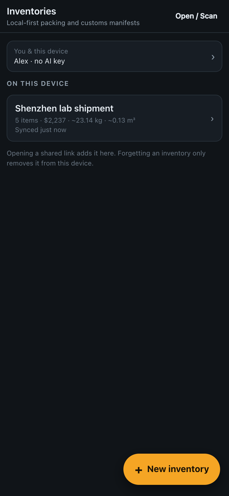
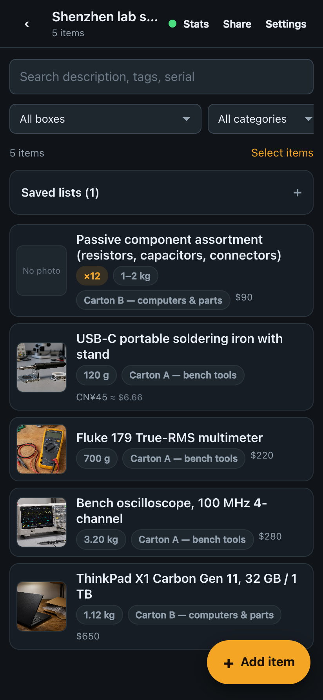
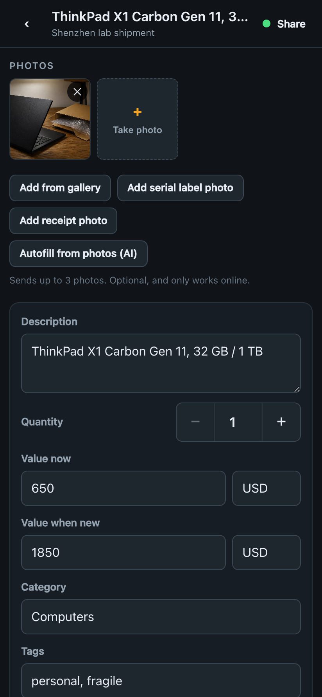
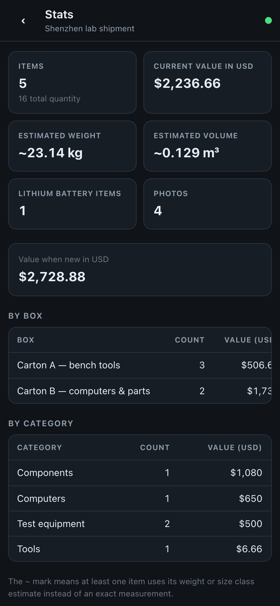
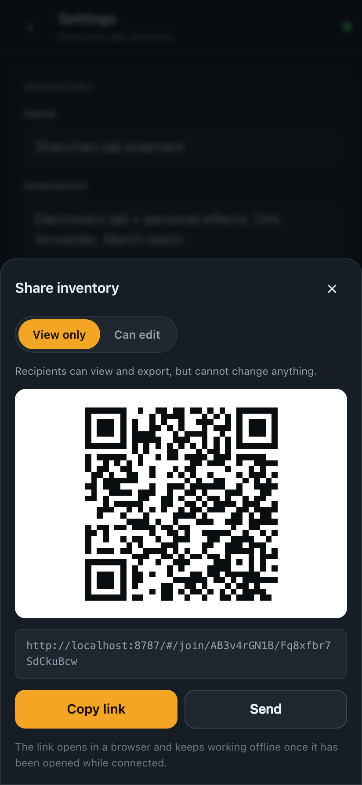
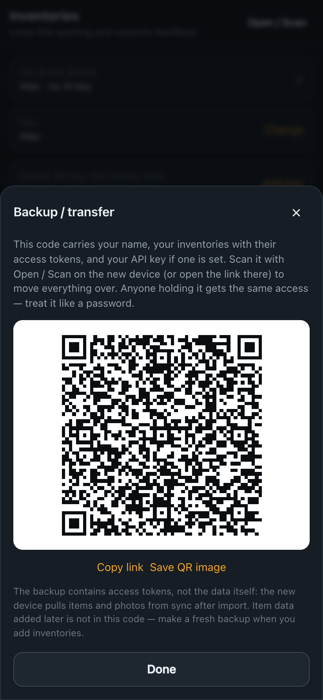

# Peerventory

Local-first inventory app for customs manifests and shipping personal effects
across borders. Every device holds the full database and works completely
offline; devices sync through a small self-hosted relay over WSS on port 443,
which looks like ordinary HTTPS traffic and works on restrictive networks.
Sync is end-to-end encrypted: the relay only ever
stores ciphertext. No third-party services hold your data.

Runs as an installable web PWA (desktop + mobile) and as an Android APK built
from the same codebase with Capacitor (with native niceties like system
back-button navigation through the app's screens).

## Screenshots

Demo inventory seeded on a local dev instance:

<p align="center">
  
  
  
</p>
<p align="center">
  
  
  
</p>

## What it does

**Item sheets built for customs.** Photos, current/new value, mandatory
weight and size quick-classes (refinable to exact grams and L×W×H mm),
serial numbers, HS codes, lithium-battery flag, country of origin,
condition, purchase info, translations — the fields a forwarder or customs
desk actually asks about, and that an AI cannot reconstruct later.

**Sync that survives bad networks.** The store is a Yjs CRDT persisted in
IndexedDB. Everything works offline; changes merge conflict-free when a
connection to the relay comes back. Two people can edit the same inventory
simultaneously. The relay speaks ordinary WSS on 443, which passes through
restrictive networks.

**End-to-end encrypted.** Items and photos are encrypted on-device
(AES-256-GCM) before they reach the relay; the relay — and anyone who can
read its disk — only stores opaque ciphertext and enforces access tokens.
The per-inventory decryption key travels exclusively in the URL **fragment**
of share links/QR codes and in device backups, which browsers never send to
any server.

**Sharing by link or QR.** Any inventory, single item, or item selection can
be shared with a short link / QR code, as **view only** or **can edit**
(separate revocable-by-rotation tokens). The link carries the decryption key
in its fragment, so read access means decrypt access. Opening a link pulls
the whole inventory to the new device, photos included, where it keeps
working offline.

**Values in any currency.** Prices can be typed in any currency ("150 cny");
conversion tables are fetched at launch and cached for offline use. Totals are
shown in the inventory's main currency.

**Locations with history.** GPS or manual entry with worldwide place search;
place labels are remembered and re-suggested within 250 m. Inventories can be
set to store **labels only** so coordinates never enter the synced document.

**Owner tracking.** Per-item owner history (on by default, disableable per
item or per inventory) — useful when a shipment mixes several people's things.

**Statistics.** Total value, weight, and volume per inventory, broken down by
carton and category — matching what goes on the customs manifest.

**Exports and imports.** One-tap YAML (canonical backup), XLSX customs
manifest, or ZIP archive with all photos. The same files import back —
drag-and-drop them onto the app (or use Import file) to rebuild an inventory,
photos included.

**Device backup / transfer.** A single QR or link carries your identity and
the access tokens of all your inventories; scan it on a new device and
everything merges over sync. Backups never downgrade existing local access.

**On-device AI autofill (optional).** Point it at the item photos and it
fills description, brand, values, weight, dimensions, HS code, translations.
Calls go directly from the device to the Anthropic API with a user-supplied
key stored only on that device (provisionable by QR). Nothing AI-related
transits the relay.

**Offline OCR.** Serial numbers can be captured with the camera; Tesseract
runs fully on-device (no CDN, works behind restrictive firewalls).

## Architecture

```
┌──────────┐  encrypted Yjs log, WSS :443  ┌────────────────────┐
│  device  │ ◄───────────────────────────► │  self-hosted relay │
│ (PWA/APK)│   photos: content-addressed   │  Hocuspocus + blob │
│ IndexedDB│   encrypted blobs (sha-256)   │  store (SQLite)    │
└──────────┘                               └────────────────────┘
```

- The relay is content-agnostic: it routes and persists an opaque append-log
  of AES-256-GCM-encrypted CRDT updates plus encrypted photo blobs; access is
  by per-document token (sha-256 hashes stored server-side). The real
  inventory document exists only on devices; decryption keys never reach the
  relay.
- Devices are the source of truth: full database on every device, offline
  first, the relay can be rebuilt from any device that holds the documents.

## Layout

- `app/` — Vite + React + TypeScript PWA; Yjs CRDT store (`y-indexeddb` local
  persistence, Hocuspocus sync client); Capacitor Android packaging
- `server/` — single Node service: Hocuspocus sync (`/sync`) +
  content-addressed photo blob API (`/api/blobs`)
- `deploy/` — Docker Compose deployments: standalone with Caddy TLS
  (`deploy/`), or behind an existing reverse proxy (`deploy/npm-proxy/`)
- `CONTRACTS.md` — binding protocol contracts between app and server
- `docs/screenshots/` — the images above

## Development

```bash
cd server && npm install && npm run dev     # sync + blob server on :8787
cd app && npm install
echo 'VITE_SERVER_ORIGIN=http://localhost:8787' > .env.local
npm run dev                                 # PWA on http://localhost:5173
```

In dev builds the store is exposed as `window.__store` / `window.__services`
for console debugging and demo seeding.

## Building

```bash
# Web (set the public origin so share links and the APK point at your server)
cd app && VITE_SERVER_ORIGIN=https://inventory.example.com npm run build

# Android APK (requires Android SDK + JDK 21)
npx cap sync android
cd android && ./gradlew assembleRelease
# then zipalign + apksigner with your own keystore
```

## Deployment

See `deploy/README.md` (standalone, Caddy terminates TLS) or
`deploy/npm-proxy/README.md` (behind an existing reverse proxy). Both are a
single `docker compose up -d` once DNS points at the box.

## Security notes

- Share links and backups carry bearer tokens **and the decryption key**:
  whoever has the link/QR has the access it grants. Treat backups like
  passwords.
- All inventories are end-to-end encrypted; the relay operator only ever
  sees ciphertext, blob sizes, and coarse metadata (doc ids, update timing,
  random per-device write ids). The key rides in the URL fragment, which the
  browser never sends to any server.
- The optional Anthropic key is stored only in the device's localStorage and
  is sent only to the Anthropic API, never to the relay.
